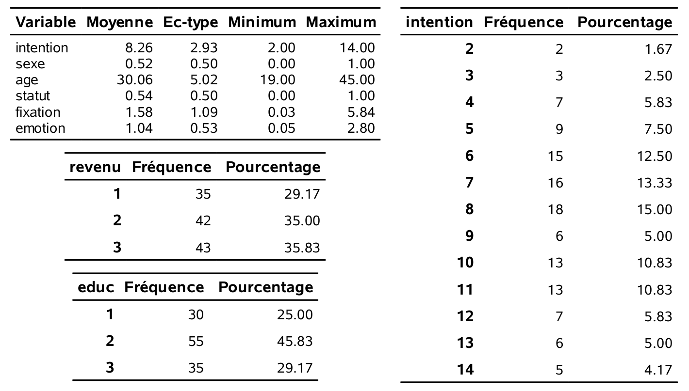
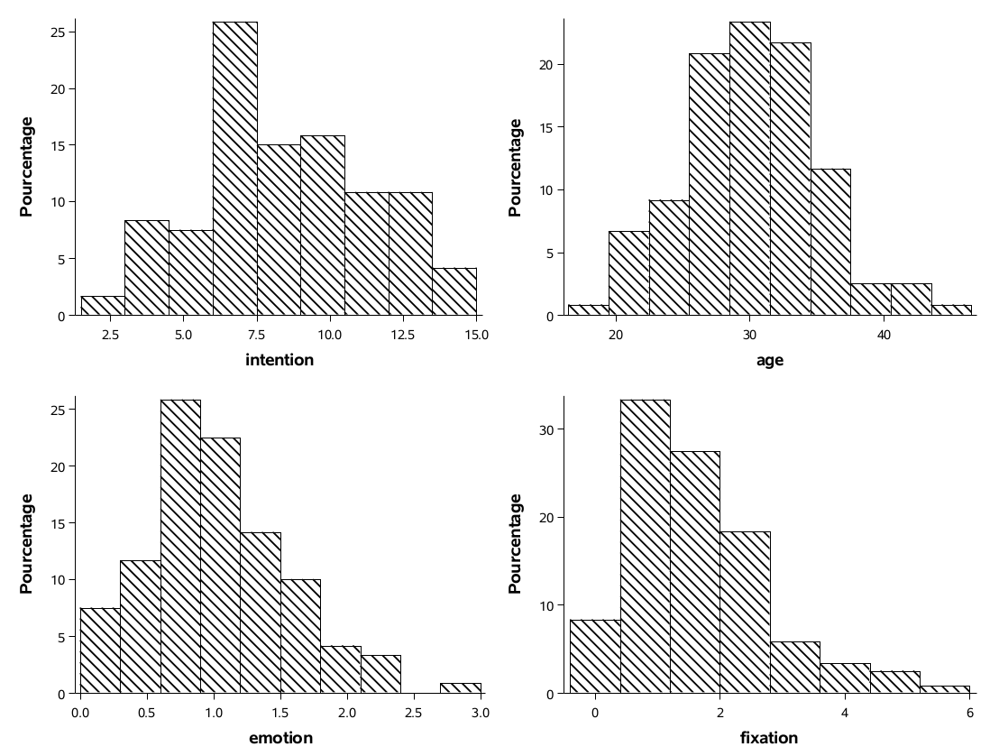
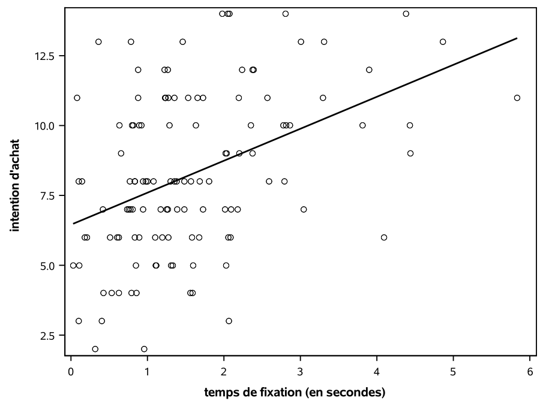
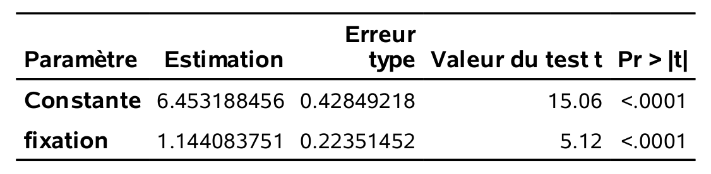
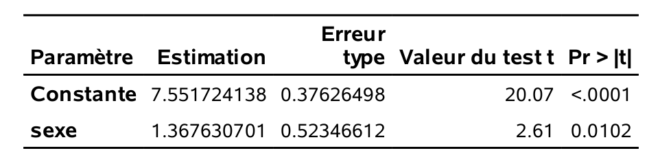
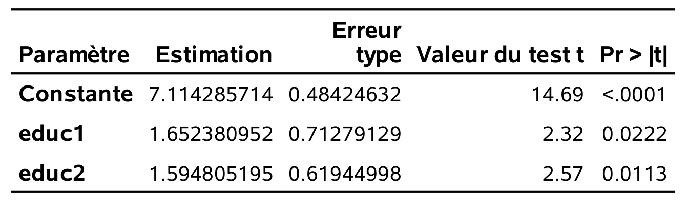
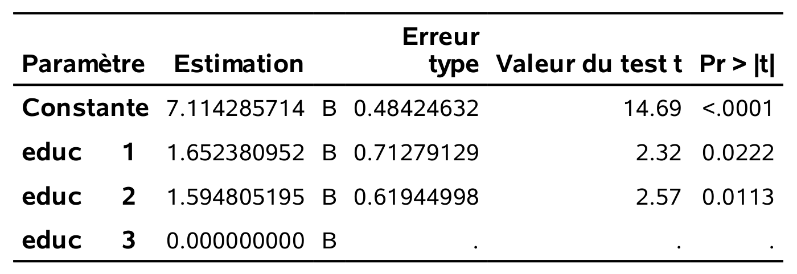

```{r set-theme, include=FALSE}
library(xaringanthemer)
style_duo_accent(
  primary_color      = "#003C71", # pantone classic blue
  secondary_color    = "#009FDF", # pantone baby blue
  header_font_google = google_font("Raleway","700"),
  text_font_google   = google_font("Raleway", "400", "400i"),
  code_font_google   = google_font("Source Code Pro"),
  text_font_size     = "30px"
)
```


```{r load-packages, message=FALSE, echo=FALSE}
knitr::opts_chunk$set(echo = TRUE, 
                      message = FALSE, 
                      warning = FALSE, 
                      out.width = '70%', 
                      fig.align = 'center', 
                      tidy = FALSE)

```

```{r xaringanExtra, echo=FALSE}
xaringanExtra::use_xaringan_extra(c("tile_view", "editable","panelset", "webcam"))

xaringanExtra::use_extra_styles(
  hover_code_line = TRUE,         
  mute_unhighlighted_code = TRUE  
)
```

## Interprétation des coefficients du modèle linéaire

On considère le modèle linéaire
\begin{align*}
Y = \beta_0 + \beta_1\mathrm{X}_1 + \cdots + \beta_p\mathrm{X}_p + \varepsilon,
\end{align*}
où $\varepsilon$ est un aléa de moyenne zéro.


- $\beta_0$ est la moyenne de la réponse quand $\mathrm{X}_1, \ldots, \mathrm{X}_p$ sont conjointement nulles.
- $\beta_j$ $(1 \leq j \leq p)$ est la différence moyenne de $Y$ quand $\mathrm{X}_j$ augmente d'une unité, *ceteris paribus*.
  - si pas d'interaction ou de fonctions impliquant $\mathrm{X}_j$ etc.


---

## Données `intention`

- Dans le cadre d’une étude réalisée au Tech3Lab, des cobayes devaient naviguer sur un site internet qui contenait, entre autres choses, une
publicité pour des bonbons.
- Pendant la navigation, un oculomètre mesurait l’endroit où se posait
le regard du sujet. On a ainsi pu mesurer si le sujet a regardé la publicité et la durée du visionnement.
- Un logiciel d’analyse des expressions faciales (FaceReader) a été utilisé pour mesurer l’émotion du sujet pendant qu’il regardait la publicité.
- À la fin de l’expérience, un questionnaire mesurait l’intention d’achat du sujet pour ces bonbons, ainsi que des variables socio-démographiques.

---

## Objectifs de l'étude

Évaluer si

1. il y a un lien entre la durée de la fixation de la publicité
et l’intention d’achat
2. l’émotion perçue est liée à l’intention d’achat.

Seuls les 120 sujets qui ont regardé la publicité sont inclus dans les données `intention`.

---

## Description des données

-  `intention`:  variable discrète entre 2 et 14; plus elle est élevée, plus le sujet exprime l’intention d’acheter ce produit. Le score a été construit en additionnant les réponses de deux questions sur une échelle de Likert allant de fortement en désaccord (1) à fortement en accord (7).
-  `fixation`: durée totale de fixation de la publicité (en secondes).
-  `emotion`: une mesure de la valence durant la fixation, soit le ratio de la probabilité d’une émotion positive sur la probabilité d’une émotion négative.

---

-  `sexe`: sexe du sujet, soit homme (0) ou femme (1).
-  `age`: âge du sujet (en années).
-  `statut`: statut matrimonial, soit célibaire (0) ou en couple (1).
-  `revenu`: variable catégorielle indiquant le revenu annuel du sujet; un parmi
(`1`) $[0,  20\ 000]$;
(`2`) $[20\ 000,  60\ 000]$;
(`3`) $60\ 000$ et plus
-  `educ`: variable catégorielle indiquant le niveau d’éducation, soit le plus haut grade obtenu
(`1`) secondaire ou moindre;
(`2`) collégial;
(`3`) universitaire.


---

## Analyse exploratoire des données

.panelset[

.panel[.panel-name[code SAS]
```{sas, eval = FALSE}
proc means data=modstat.intention mean std min max maxdec=2;
var intention sexe age statut fixation emotion;
run;

proc freq data=modstat.intention;
tables intention revenu educ;
run;

proc sgplot data=modstat.intention;
histogram intention emotion;
run;

```
]

.panel[.panel-name[sortie SAS (1)]

```{r intention_EDA_1, echo = FALSE, out.width="55%"}

```

]
.panel[.panel-name[sortie SAS (2)]

```{r intention_EDA_2, echo = FALSE, out.width="55%"}

```

]
]
---

## Terminologie

- variable **réponse** ( $Y$ ) ou régressande: variable d’intérêt
- variables **explicatives**, **covariables**, régresseurs ou prédicteurs ( $\mathbf{X}$ ): variables potentiellement liées à $Y$.


Dans notre exemple, on a

- variable réponse: `intention`,
- variables explicatives ( $\mathbf{X}$ ): `fixation`, `emotion`, `sexe`, `age`, `revenu`, `educ`, `statut`.

On cherche à mesurer l’effet de `fixation` et `emotion` sur la variable
`intention` en tenant compte des variables socio-démographiques

---

### Modèle linéaire simple

Considérons un modèle avec $\texttt{fixation}$ comme unique régresseur.

.panelset[

.panel[.panel-name[code SAS]

```{sas, eval = FALSE}
proc sgplot data=modstat.intention noautolegend;
scatter y=intention x=fixation;
reg y=intention x=fixation;
yaxis label="intention d'achat";
xaxis label="temps de fixation (en secondes)";
run;

proc glm data=modstat.intention;
 *Imprimer seulement les coefficients;
ods select ParameterEstimates;
model intention=fixation;
run;
```

]


.panel[.panel-name[Nuage de points]

```{r intention_EDA_3, echo = FALSE, out.width="50%"}

```

]

.panel[.panel-name[Estimés]

```{r intention_fixation, echo = FALSE, out.width="60%"}

```

La droite ajustée est

\begin{align*}
\widehat{\texttt{intention}} = 6.45 + 1.14 \texttt{fixation}
\end{align*}

Problèmes?
]

]

---


<!-- -  **slope** $\widehat{\beta}_1=1.14$: for every additional second of \texttt{fixation}, the intention score increases *on average* by $1.14$. The longer a person fixates on an ad, the higher their intention of buying the product. -->
<!-- -  **intercept** $\widehat{\beta}_0=6.45$: the mean intention score for individuals who did not look at the ad (i.e., when $\texttt{fixation}=0$)  (but only people who looked at the ad were included in the dataset). -->

<!-- Caveats? (consider the fitted value for $\texttt{fixation}=7$). -->


## Spécification de variables catégorielles en **SAS**

- La commande `class` crée une variable catégorielle (collection de variables binaires).
- La catégorie de référence est spécifiée à l'aide de `ref`; par défaut, c'est la première valeur rencontrée.
- Dans **R**, l'analogue est `factor` et la référence est la première valeur en ordre alphanumérique.

---

## Variable explicative binaire

Soit un modèle linéaire avec $\texttt{sexe}$ comme seul régresseur.


.panelset[


.panel[.panel-name[code SAS]

```{sas, eval = FALSE}
proc glm data=modstat.intention;
ods select ParameterEstimates;
model intention=sexe;
run;

/* Si pas codé avec 0/1, utiliser "class" */
proc glm data=modstat.intention;
class sexe(ref="0");
model intention=sexe / solution;
run;
```

]


.panel[.panel-name[Estimés]

Le modèle postulé est
\begin{align*}
\texttt{intention} = \beta_0 + \beta_1 \texttt{sexe} + \varepsilon
\end{align*}

```{r e6, out.width = '55%', echo = FALSE}

```

]

.panel[.panel-name[Interprétation]

-  La moyenne du score d’intention d’achat des hommes est de 7.55
points.
- La moyenne du score d’intention d’achat des femmes est de 8.92
points.
L’estimé de la « pente » est $\widehat{\beta}_1=$ 1.37, soit une augmentation de l’intention moyenne d’achat de 1.37 points pour les femmes par
rapport à la moyenne des hommes.

]
]

---

## Variables explicatives catégorielles

-  Les variables  $\texttt{revenu}$ et $\texttt{educ}$ sont catégorielles et chacune a trois niveaux.
-  L’inclusion d’une variable catégorielle à $k$ niveaux requiert $k-1$
variables explicatives additionnelles dans le modèle. Par exemple
  -  `educ1 = 1` si $\texttt{educ = 1}$ et zéro sinon.
  -  `educ2 = 1` si $\texttt{educ = 2}$ et zéro sinon.

---

Si le modèle contient l’ordonnée à l’origine, inclure une troisième variable binaire est superflu.

|`educ` | ordonnée à l'origine | `educ1` | `educ2`|
|:--:|:--:|:--:|:--:|
| `1` | $1$ | $1$ | $0$ |
| `2` | $1$ | $0$ | $1$ |
| `3` | $1$ | $0$ | $0$ |

-  Quand $\texttt{educ}=3$ (référence), les deux indicatrices sont nulles.

---

## Ajuster le modèle avec des indicatrices

Pour ajuster le modèle, on peut remplacer $\texttt{educ}$ par les deux indicatrices


.panelset[


.panel[.panel-name[code SAS (1)]

```{sas, eval = FALSE}
data intention; 
set modstat.intention; 
educ1=(educ=1); 
educ2=(educ=2); 
run;

proc glm data=intention; 
ods select ParameterEstimates;
model intention=educ1 educ2; 
run;

 /* Alternative avec `class` */
proc glm data=modstat.intention; 
ods select ParameterEstimates;
class educ(ref="3"); 
model intention=educ / solution; 
run;
```

]
.panel[.panel-name[sortie SAS (1)]


```{r e7, out.width = '55%', echo = FALSE}

```
]
.panel[.panel-name[sortie SAS (2)]


```{r e8, out.width = '55%', echo = FALSE}

```

Les résultats sont identiques selon que l'on crée les indicateurs manuellement ou avec `class`.

]
]

---

## Interprétation des effets différentiels

-  La moyenne empirique de l'intention pour les trois catégories d'éducation est  $8.77, 8.71$, et $7.11$ pour respectivement $\texttt{1}$, $\texttt{2}$ et $\texttt{3}$.
-  La moyenne d' $\texttt{intention}$ est $1.65$ points plus élevée quand $\texttt{educ}=\texttt{1}$ que quand $\texttt{educ}=\texttt{3}$, etc.
-  Pour comparer $\texttt{educ}=\texttt{1}$ et $\texttt{educ}=\texttt{2}$, on pourrait réajuster le modèle en changeant la catégorie de référence (exercice).


---

## Commentaire sur la commande `class`

- Dans **SAS**, les noms des niveaux de la variable catégorielles sont sensibles à la casse à l'intérieur de `class`, par exemple, `class echelon(ref="ProfAdjoint")`
- **SAS** n'imprimer pas le tableau des coefficients lorsque `class` est spécifié, hormis si `/ solution` est ajouté à la ligne contenant l'appel à `model`.