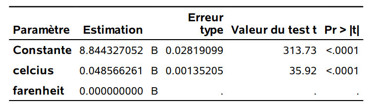

```{r set-theme, include=FALSE}
library(xaringanthemer)
style_duo_accent(
  primary_color      = "#003C71", # pantone classic blue
  secondary_color    = "#009FDF", # pantone baby blue
  header_font_google = google_font("Raleway","700"),
  text_font_google   = google_font("Raleway", "400", "400i"),
  code_font_google   = google_font("Source Code Pro"),
  text_font_size     = "30px"
)
```


```{r load-packages, message=FALSE, echo=FALSE}
knitr::opts_chunk$set(echo = TRUE, 
                      message = FALSE, 
                      warning = FALSE, 
                      out.width = '70%', 
                      fig.align = 'center', 
                      tidy = FALSE)

```

```{r xaringanExtra, echo=FALSE}
xaringanExtra::use_xaringan_extra(c("tile_view", "editable","panelset", "webcam"))
xaringanExtra::use_extra_styles(
  hover_code_line = TRUE,         #<<
  mute_unhighlighted_code = TRUE  #<<
)
```


## Transformations linéaires des variables explicatives

Considérez le log du nombre quotidien de locations de Bixi en fonction de la température en degrés Celcius et Farenheit.

Supposez que l'effet de la température sur le log du nombre de locations est
\begin{align*}
\texttt{lognutilisateur} = \alpha_0+ \alpha_1 \texttt{celcius} + \varepsilon.
\end{align*}

- Interprétation de $\alpha_1$: *l'augmentation moyenne du log du nombre de locations par jour quand la température aucmente de $1^{\circ}\mathrm{C}$ *.

Le modèle en Farenheit est
\begin{align*}
\texttt{lognutilisateur} = \gamma_0 + \gamma_1\texttt{farenheit} + \varepsilon.
\end{align*}

---

## Sortie **SAS**

```{r bixitemp1, echo = FALSE, out.width = '60%'}
knitr::include_graphics(
  c('img/c2/diapos3-e20.png', 'img/c2/diapos3-e21.png')
  )
```

Les deux unités de mesures sont reliées par la transformation linéaire
\begin{align*}
1.8 \texttt{celcius} + 32 = \texttt{farenheit}.
\end{align*}
et on trouve que $\alpha_0=\gamma_0 + 32\gamma_1$ et $\alpha_1=1.8\gamma_1$.

---

## Unicité de la solution

Les paramètres du modèle postulé avec les deux prédicteurs, 
\begin{align*}
\texttt{lognutilisateur} = \beta_0 + \beta_{\texttt{c}} \texttt{celcius} + \beta_{\texttt{f}} \texttt{farenheit} + \varepsilon,
\end{align*}
ne sont pas **identifiables**, puisque toute combinaison linéaire des deux solutions donne les même valeurs ajustées.

Pour $k \in \mathbb{R}$, $\beta_0 = k\alpha_0 + (1-k)\gamma_0$, $\beta_1=k\alpha_1$ et $\beta_2=(1-k)\gamma_1$ sont équivalents.

Le rang de $\mathbf{X}$ est 2, mais la matrice de plan d'expérience a 3 colonnes.

- $\mathbf{X}^\top\mathbf{X}$ n'est pas inversible.
- la solution de l'équation normale n'est donc **pas unique**.

---

### Colinéarité

```{r bixitemp2, echo = FALSE, out.width="60%"}

```

**SAS** inclut un avertissement si les données sont *exactement* colinéaires.
> `Note: The X'X matrix has been found to be singular, and a generalized inverse was used to solve the normal equations. Terms whose estimates are followed by the letter 'B' are not uniquely estimable.`

