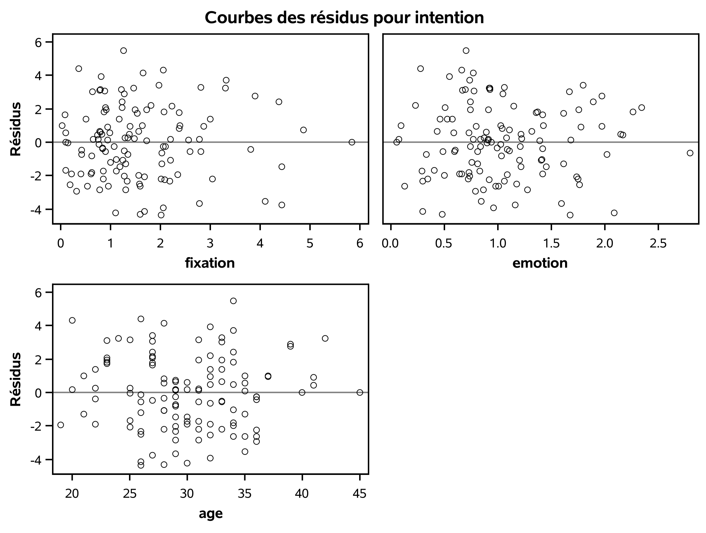
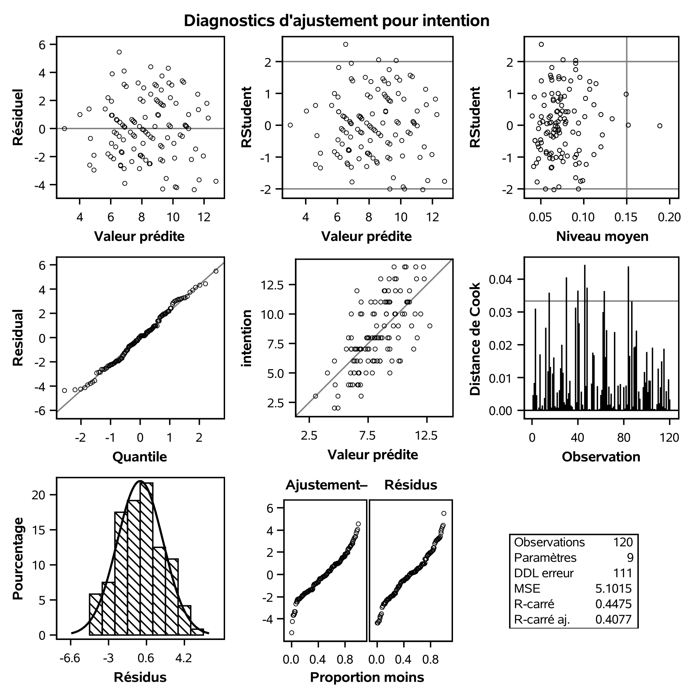
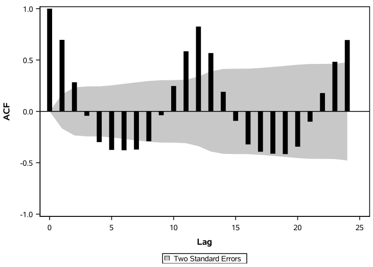
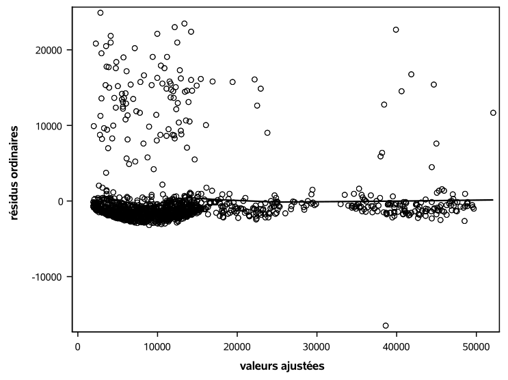
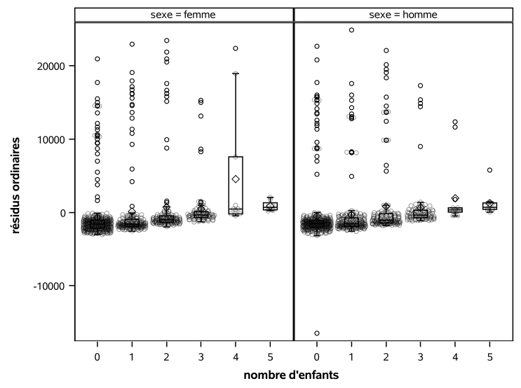
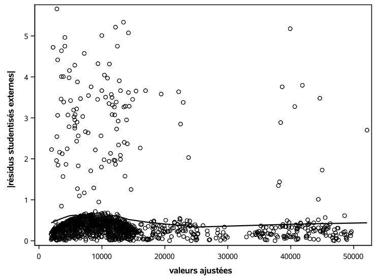
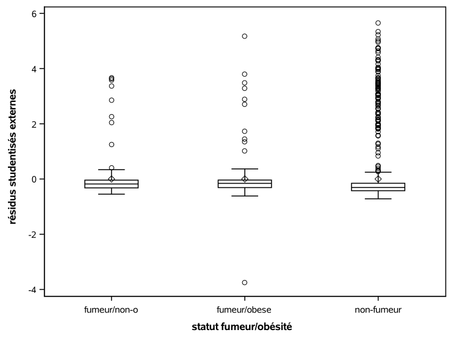
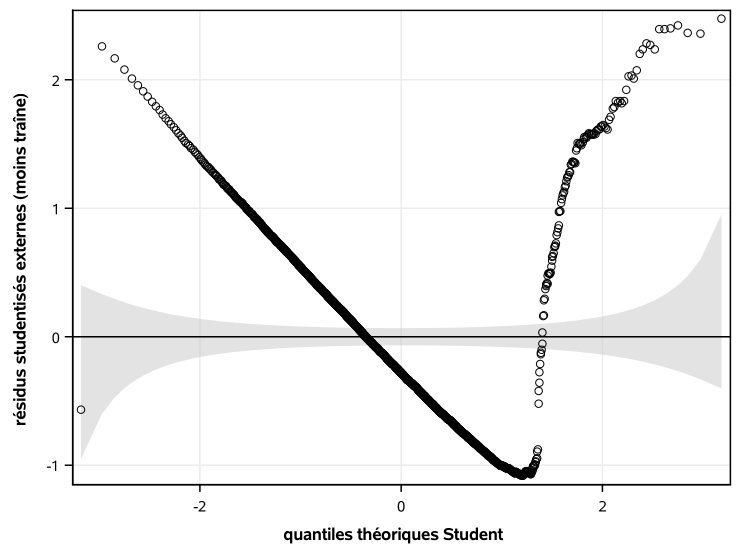

```{r set-theme, include=FALSE}
library(xaringanthemer)
style_duo_accent(
 primary_color   = "#003C71", # pantone classic blue
 secondary_color  = "#009FDF", # pantone baby blue
 header_font_google = google_font("Raleway","700"),
 text_font_google  = google_font("Raleway", "400", "400i"),
 code_font_google  = google_font("Source Code Pro"),
 text_font_size   = "30px"
)
```


```{r load-packages, message=FALSE, echo=FALSE}
knitr::opts_chunk$set(echo = TRUE, 
           message = FALSE, 
           warning = FALSE, 
           out.width = '70%', 
           fig.align = 'center', 
           tidy = FALSE)

```

```{r xaringanExtra, echo=FALSE}
xaringanExtra::use_xaringan_extra(c("tile_view", "editable","panelset", "webcam"))
xaringanExtra::use_extra_styles(
 hover_code_line = TRUE,     #<<
 mute_unhighlighted_code = TRUE #<<
)
```

## Postulats de validité du modèle

On postule que les erreurs $\varepsilon_i \sim \mathsf{No}(0,\sigma^2)$ sont indépendantes et identiquement distribuées.

### Implications

- indépendance
- linéarité
- homoscédasticité (égalité des variances)
- normalité


---

### Postulats revisités

1. **Indépendance**: les erreurs $\varepsilon_1, \ldots, \varepsilon_n$ sont indépendantes, idem pour les observations)
2. **Linéarité**: l'espérance des erreurs est $\mathsf{E}(\varepsilon_i)=0$ pour tout $i=1, \ldots, n$.
 - cela implique que le modèle pour la moyenne est correctement spécifié, d'où $\mathsf{E}(Y \mid \mathbf{X})=\beta_0+\beta_1\mathrm{X}_1+\cdots + \beta_p \mathrm{X}_p$
 - toutes les variables explicatives importantes sont incluses dans le modèle.
 - leur effet (présumé linéaire) est adéquatement représenté par le modèle.
3. **Homoscédasticité**: la variance des erreurs est **constante** $\mathsf{Va}(\varepsilon_i)=\sigma^2$ pour $i=1, \ldots, n$.
 - corollaire: la variance $Y_i$ est constante et ne dépend pas de $\mathbf{X}$.
4. **Normalité**: les termes d'erreurs $\boldsymbol{\varepsilon}$ suivent une loi normale.

---

### Diagnostics graphiques (par défaut)

- Dans la procédure `glm`, l'option `plots=diagnostics residuals(smooth)` permet d'obtenir une panoplie de diagrammes pour analyser les résidus (et faires des graphiques des résidus ordinaires contre les variables explicatives).

Dans **SAS**, on peut sauvegarder la sortie de `glm` à l'aide de la commande`output`. 

- Dans l'extrait de code qui suit, on sauvegarde
  - les valeurs ajustées `ajustees`
  - les résidus ordinaires `reso`
  - les résidus studentisés externes `rsc` 
dans une base de données temporaire `residus`.

---

.panelset[

.panel[.panel-name[Code **SAS**]
```{sas eval=FALSE}
ods graphics on;
proc glm data=modstat.intention 
 plots=diagnostics residuals;
class sexe educ revenu;
model intention=fixation emotion
 sexe age revenu educ statut / ss3 solution;
output out=residus predicted=ajustees r=reso rstudent=rsc;
run;
```

]

.panel[.panel-name[Sortie **SAS** (1)]
```{r xvsresid_sas1, echo = FALSE, out.width="55%"}

```
]
.panel[.panel-name[Sortie **SAS** (2)]
```{r xvsresid_sas2, echo = FALSE, out.width="45%"}

```
]

]

---

### Graphiques 

Dans le sens des aiguilles d'une montre, en partant du coin supérieur gauche:

- résidus ordinaires contre valeurs ajustées (linéarité)
- résidus studentisés contre valeurs ajustées (hétéroscédasticité)
- effet de levier (influence des observations sur l'estimateur)
- diagramme quantile-quantile des résidus (normalité)
- nuage de point de $Y_i$ versus $\hat{Y}_i$ (linéarité)
- distance de Cook (détection des valeurs aberrantes)
- densité et histogramme des résidus ordinaires (normalité)

---

### Conclusion
 
Dans l'exemple, tous les indicateurs sont verts et nous n'avons aucune raison de douter des postulats de notre modèle. 


Cela conforte l'idée que les résultats de notre analyse (conclusions des tests d'hypothèse et intervalles de confiances) sont valides.
 
---

## Indépendance

.panelset[

.panel[.panel-name[Contexte]

- Les données `trafficaerien` contient des données mensuelles du traffic aérien mondial dans les années 50.
- On ajuste un modèle log-linéaire avec mois (catégorielle) et année pour expliquer le nombre de passagers.
- La fonction d'autocorrélation (ACF) indique une dépendance résiduelle mensuelle et annuelle.

]
.panel[.panel-name[Corrélogramme]
```{r acfplot_sas, echo = FALSE, out.width="55%"}

```
]
.panel[.panel-name[Code **SAS**]
Ce graphique ne sert que pour les séries chronologiques!

```{sas acf, eval = FALSE}
data trafficaerien;
set modstat.trafficaerien;
lnpassagers = log(passagers);
run;

proc glm data=trafficaerien;
model lnpassagers = mois annee;
output out=trafficaerienresid r=reso;
run;

proc timeseries data=trafficaerienresid 
  plots=(acf pacf);
var reso;
run;
```
]
]

---

## Postulat de linéarité

Plusieurs graphiques potentiels avec les résidus ordinaires...

- contre les valeurs ajustées
- contre les variables explicatives
- contre des variables omises (pas incluses dans le modèle pour la moyenne)
- diagrammes de régression partielle

---

### Données `assurance`

On considère un modèle linéaire avec `age`, `sexe`, `region` et une interaction entre `fumeur`/`obese` et `imc`.

- Les diagrammes nous indiquent que le modèle est inadéquat, mais les apparences sont parfois trompeuses: 
 - à cause de valeurs abnormalement élevées (trop grand frais), la moyenne estimée des non-fumeurs est plus grande que la majorité des observations
 - l'ajustement est bon hormis pour ces valeurs inattendues: cela a des répercussions, notamment pour le diagramme quantile-quantile.
 - une transformation logarithmique pourrait potentiellement réduire l'impact de ces valeurs, ou alors une régression robuste qui pondère à la baisse les points trop différents.

---


.panelset[

## Linéarité

.panel[.panel-name[Sortie **SAS**]

```{r insurance_fittedores, echo = FALSE, out.width="55%"}

```
]
.panel[.panel-name[Code **SAS**]


```{sas codefittedvsores, eval = FALSE}
proc glm data=assurance;
class fumobese sexe region;
model frais = fumobese|imc age sexe region / solution ss3;
output out=residus predicted=vajustees 
    r=reso rstudent=rsc;
run;

/* Graphique des résidus ordinaires contre valeurs ajustées */
proc sgplot data=residus noautolegend;
scatter y=reso x=vajustees;
loess y=reso x=vajustees; 
xaxis label="valeurs ajustées";
yaxis label="résidus ordinaires";
run;

```
]
]

---

## Linéarité

.panelset[
.panel[.panel-name[Sortie **SAS** (1)]

```{r insurance_bmiores, echo = FALSE, out.width="55%"}
knitr::include_graphics('img/c2/diaggraph_e2.png')
```

Il n'y a plus de structure dans les résidus face à l'indice de masse corporelle.

]

.panel[.panel-name[Sortie **SAS** (2)]

```{r insurance_childrenores, echo = FALSE, out.width="55%"}

```

Une traîne (linéaire) pour le nombre d'enfants serait nécessaires. Notez que la boîte à moustache pour quatre enfants (anormale) est un artifice d'une faible taille d'échantillon.

]
.panel[.panel-name[Code **SAS**]


```{sas codebmivsores, eval = FALSE}
/* Résidus ordinaires contre indice de masse corporelle */
proc sgpanel data=residus noautolegend;
panelby fumeur / uniscale=row;
scatter y=reso x=imc;
loess y=reso x=imc; 
rowaxis label="résidus ordinaires";
colaxis label ="indice de masse corporelle";
run;

/* Résidus contres variables non incluse*/
proc sgpanel data=residus noautolegend;
panelby sexe / uniscale=row;
vbox  reso / category=enfant;
scatter  x=enfant y=reso / jitter transparency=0.6;
colaxis label="nombre d'enfants";
rowaxis label="résidus ordinaires"; 
run;
```
]
]

---

## Homoscédasticité

.panelset[
.panel[.panel-name[Sortie **SAS** (1)]

```{r insurance_jsr, echo = FALSE, out.width="55%"}

```

Pas de preuve qu'il y a une traîne dans la variance.

]

.panel[.panel-name[Sortie **SAS** (2)]

```{r insurance_boxplot, echo = FALSE, out.width="55%"}

```

Pas d'hétéroscédasticité de groupe (mais toujours des frais anormalement élevés inexpliqués qui engendrent de larges résidus).
]

.panel[.panel-name[Code **SAS**]


```{sas codejsrhetero, eval = FALSE}
data residus;
set residus;
arsc = abs(rsc);
run;

proc sgplot data=residus noautolegend;
scatter y=arsc x = vajustees;
loess y=arsc x = vajustees;
yaxis label = "|résidus studentisés externes|";
xaxis label = "valeurs ajustées";
run;

proc sgplot data=residus noautolegend;
vbox rsc / category=fumobese;
yaxis label = "résidus studentisés externes";
xaxis label = "statut fumeur/obésité";
run;
```
]
]

---

### Diagramme quantile-quantile


Pour créer un diagramme quantile-quantile à la mitaine

- trier les données (résidus studentisés externes)
- calculer les positions théoriques $i/(n+1)$, $i=1, \ldots, n$
- calculer la transformation inverse $F^{-1}\{i/(n+1)\}$, où $F^{-1}$ est la fonction quantile de la loi postulée. 
- ajouter des intervalles de confiance ponctuels approximatives (avec des statistiques d'ordre)
  - $U_{(j)} \sim \mathsf{Be}(j, n+1-j)$
  - on calcule les quantiles $0.025$ et $0.975$ de la loi $\mathsf{Be}(j, n+1-j)$
  - transformer ces variables à l'échelle Student
  - éliminer la traîne

---


### Normalité

.panelset[

.panel[.panel-name[Sortie **SAS**]

```{r insurance_qq, echo = FALSE, out.width="55%"}

```


]
.panel[.panel-name[Code **SAS** (1)]


```{sas codeqq, eval = FALSE}
data residusqq; 
set residus;
keep rsc;
run;

proc sort data=residusqq; 
by rsc; 
run;

data residusqq;
set residusqq nobs=nobs;
pp = _N_  / (nobs + 1);
pplow = quantile("beta", 0.025, _N_, nobs + 1 - _N_);
pphigh = quantile("beta", 0.975, _N_, nobs + 1 - _N_);
q = quantile("t", pp, 1329);
qlow = quantile("t", pplow, 1329);
qhigh = quantile("t", pphigh, 1329);
qdet = rsc - q;
qdethigh = qhigh - q;
qdetlow = qlow - q;
run;
```

]
.panel[.panel-name[Code **SAS** (2)]

```{sas codeqq2, eval = FALSE}
proc sgplot data=residusqq noautolegend; 
band x=q upper=qdethigh lower=qdetlow / 
  fill transparency=.5 legendlabel="intervalles de confiance ponctuels";
lineparm x=0 y=0 slope=0; 
scatter x=q y=qdet;
xaxis label="quantiles théoriques Student" grid; 
yaxis label="résidus studentisés externes (moins traîne)" grid;
run;
```
]
]

---

## Diagramme quantile-quantile

- La procédure `univariate` permet de faire un diagramme QQ pour quelques lois, incluant la loi normale.
- On pourrait utiliser cette dernière en misant sur l'approximation de la loi Student par une loi normale si les degrés de liberté $n-p-2$ est grand.

```{sas qqplothist, eval = FALSE}
/* Histogramme des résidus students et densité */
proc sgplot data=residus;
histogram rsc;
density rsc / type=kernel;
keylegend / position=bottom;
run;

proc univariate data=residus noprint;
qqplot rsc / normal(mu=est sigma=est l=2)
square;
run;
```